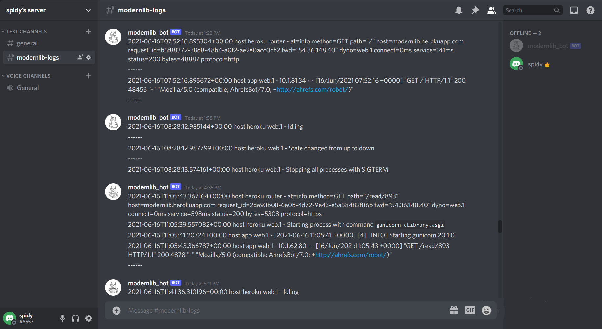

# heroku2discord-logdrain
An extremely simple heroku to discord-server https logdrain

### Screenshot

###### [modernlib](https://modernlib.herokuapp.com) is a cool library i made currently having more than 10,000 books, check it out [here](https://modernlib.herokuapp.com)

### Terms used 
##### Log source - 
Log sources are any processes that might want to emit log entries relevant to your app. Some examples: your web dynos, the Heroku platform, the Heroku routing stack, and many add-ons.

##### Log drain - 
Log drains are any network services that want to consume your app’s logs, either for automatic processing, archival, or human consumption. Examples include the Heroku command-line tool and several log-processing and management add-ons.

### Heroku's Logplex 
TL;dr : Logplex routes messages from sources to drains.

Heroku’s Logplex router is responsible for collating and distributing the log entries generated by your app and other components of the Heroku platform. It makes these entries available through the Logplex API and the Heroku command-line tool.

In a distributed system such as Heroku, manually accessing logs spread across many dynos provides a very disjointed view of an application’s event stream and omits relevant platform-level events. The Logplex facility solves these issues in an accessible and extensible manner.

Read more about [Heroku's Logplex](https://devcenter.heroku.com/articles/logplex)

### Requirements 
- Discord Bot Token
- Discord Channel Id
- Web service Endpoint (URL where your logdrain server is hosted)

### Steps

#### 1. Create a Discord Bot and get its token

- Its super simple to create a discord bot, still if you're new to this just make sure you are logged in to discord and follow this [guide](https://discordjs.guide/preparations/setting-up-a-bot-application.html#creating-your-bot)
- copy `bot token` and keep it handy, will need it later
	
#### 2. Get `Channel ID` to send logs to

- First make sure you have Developer Mode enabled on your Discord by visiting your Discord settings and going to Appearance.
- To get a `Channel ID` right click the channel and click on “Copy ID” then paste it into your Discord or on a text editor. Alternatively type the channel as a mention and place a backslash \ in front of the mention. It should look like this <#475182341782896651> and the number is the ID.
- keep this `Channel ID` handy, will need it later

#### 3. Add Bot to your server

Once you have your Bot setup, now you need to add your bot to your server to start receiving logs. If you dont know how, follow this [guide](https://discordjs.guide/preparations/adding-your-bot-to-servers.html#adding-your-bot-to-servers)

#### 4. Deploying your Logdrain server (Flask app) and getting Web service endpoint

To make your logdrain available to your heroku app's logplex, it needs to be publically available, for this you'll need to deploy you app to any one hosting provider of your choice. 
	
- set two enviornment variables `BOT_TOKEN` and `CHANNEL_ID` to the values you got in step 1 and 2.
	
###### cmd
	
	set BOT_TOKEN=YOUR_TOKEN_HERE
	set CHANNEL_ID=YOUR_CHENNEL_ID_HERE
		
###### powershell
	
	$env:BOT_TOKEN=YOUR_TOKEN_HERE
	$env:CHANNEL_ID=YOUR_CHENNEL_ID_HERE
		
###### linux
	
	export BOT_TOKEN=YOUR_TOKEN_HERE
	export CHANNEL_ID=YOUR_CHENNEL_ID_HERE
		
###### heroku
	
https://devcenter.heroku.com/articles/config-vars
		
Note - You don't need to deploy logdrain on heroku for this to work, you can choose any hosting provider of your choice.
	
Important - Without enviornment variables `BOT_TOKEN` and `CHANNEL_ID` flask app wouldn't work, if you cannot set enviormnent variables, set their values directly in the python file, although its not secure, it will make your app work.
	
#### 5. Adding our Logdrain to heroku's logplex

make sure you have [heroku cli](https://devcenter.heroku.com/articles/heroku-cli) installed and logged in to your heroku account, then follow along
	
`heroku drains:add https://mylogdrain.com/logs -a myapp`
	
- replace `https://mylogdrain.com` with the deployment link/web service endpoint/app's url you got in the last step.
- replace `myapp` with the name of app for which you have create logdrain.
- `/logs` is important as it indicates the route which the logplex will send logs to.
	
##### That's it ! you should start receiving logs on your discord channel now
	
	
